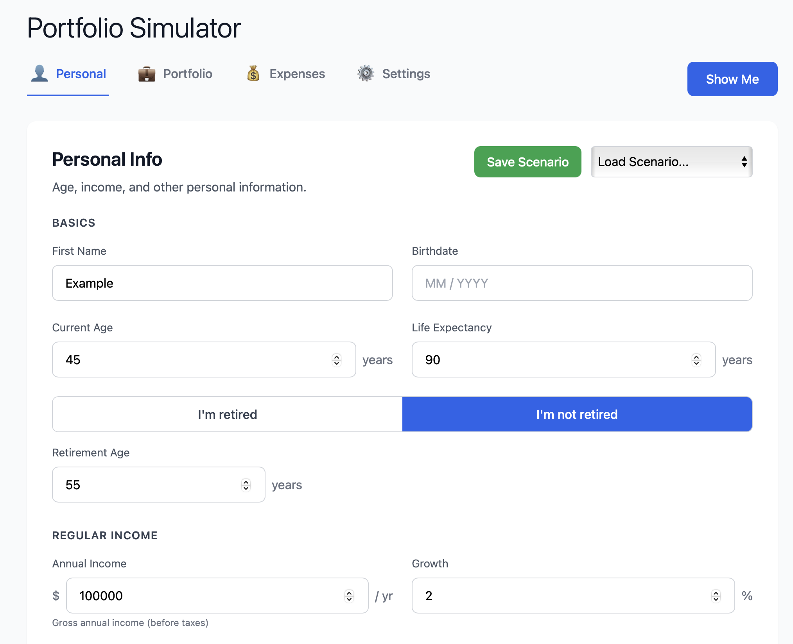
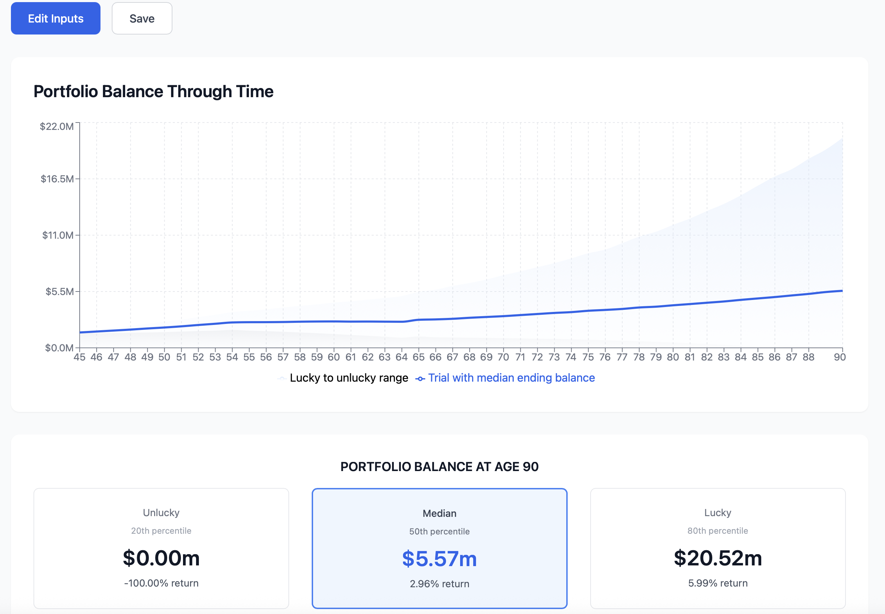

# Retirement Monte Carlo Simulator

A sophisticated financial simulation tool for retirement planning with **encrypted data storage**, built with **FastAPI** (backend) and **React** (frontend). This platform models multiple account types, asset allocations, income streams, and spending patterns — running 10,000 Monte Carlo simulations with industry-leading fat‑tail modeling for realistic risk assessment.

## ✨ Features
- 🎲 **Advanced Monte Carlo Engine** — Kou Log-Safe algorithm with calibrated fat-tail events (2-5% impact)
- 🔐 **Encrypted Data Storage** — AES-256 encryption for all financial data
- 📊 **Multi‑account portfolio modeling** — 401k, IRA, taxable, crypto, CDs with custom allocations
- 💰 **Comprehensive income modeling** — Social Security, pensions, consulting ladders
- 📈 **Realistic market dynamics** — Correlated returns, sequence risk, Black Swan coordination
- 🎯 **Interactive visualization** — Real-time portfolio paths with percentile bands
- 💾 **Persistent scenarios** — Encrypted SQLite database with transparent encryption/decryption

## Requirements
- **Backend**: Python 3.9+
- **Frontend**: Node.js 18+
- **Package Manager**: [uv](https://github.com/astral-sh/uv)

## 🚀 Quick Start

```bash
# Clone the repository
git clone https://github.com/seaberger/retirement_calculator.git
cd retirement_calculator

# Install dependencies
uv pip install -r requirements.txt
cd frontend && npm install && cd ..

# Start both services
./check_services.sh

# Open browser to
http://localhost:5177
```

## 📖 Documentation

- **[User Manual](docs/USER_MANUAL.md)** — Complete guide for using the application
- **[Developer Guide](CLAUDE.md)** — Technical documentation for development
- **[API Docs](http://localhost:8020/docs)** — Interactive API documentation (when running)

## Screenshots

### Personal Information Tab

*Configure your age, retirement status, and income projections. Features include:*
- Retirement toggle (I'm retired / I'm not retired)
- Dynamic retirement age field for pre-retirees
- Regular income with growth projections
- Multiple retirement income streams (Social Security, pensions, etc.)

### Simulation Results

*View Monte Carlo simulation results with:*
- Portfolio balance projection chart showing median and confidence bands
- Lucky (80th percentile) vs Unlucky (20th percentile) scenarios
- Detailed age-by-age breakdown table
- Market return analysis across percentiles
- Success probability metrics

## 🔐 Security

Your financial data is protected with:
- **AES-256 encryption** for all scenario data
- **PBKDF2 key derivation** with 100,000 iterations
- **Environment-based key management** via `.env` file
- **Transparent encryption/decryption** during use

⚠️ **Important**: Keep your `.env` file secure and never commit it to version control!

## Service Management

```bash
# Start services (auto-starts if not running)
./check_services.sh

# Stop all services
./stop_services.sh

# Restart services
./restart_services.sh
```

## Project Structure
```
retirement_calculator/
├── src/
│   ├── backend/          # FastAPI server + Monte Carlo engine
│   │   ├── monte_carlo/  # Simulation engine with fat-tail models
│   │   └── encrypted_database.py  # Encryption layer
│   └── frontend/         # React application
├── tests/                # Comprehensive test suite
├── docs/                 # Documentation
│   └── USER_MANUAL.md    # Complete user guide
├── params/               # Calibrated parameters
└── data/                 # Encrypted SQLite database
```

## License
Private repository — all rights reserved


